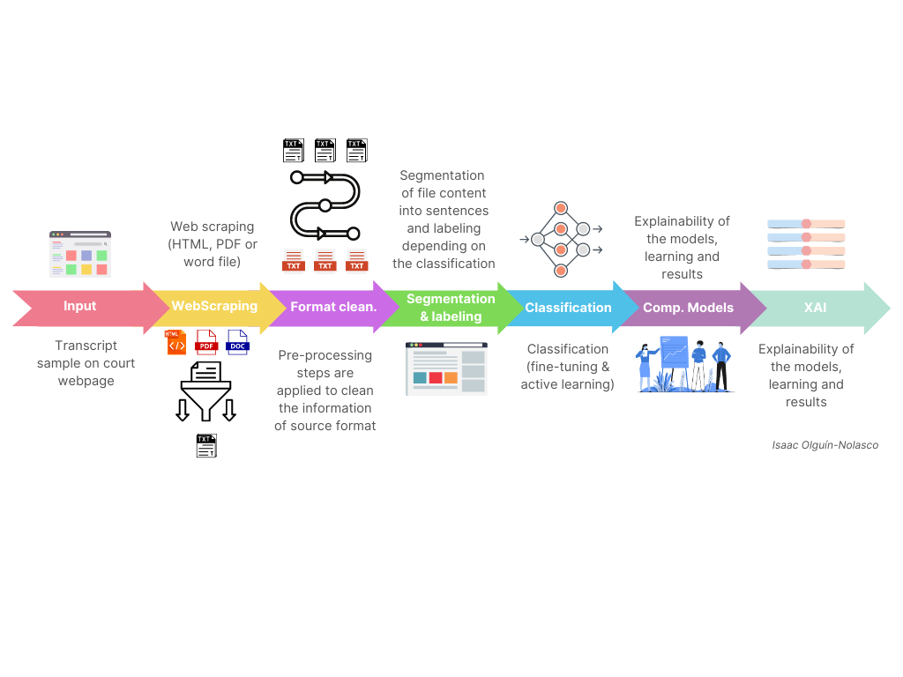
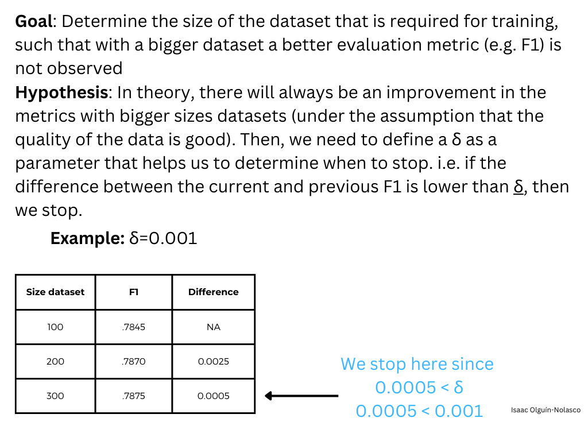
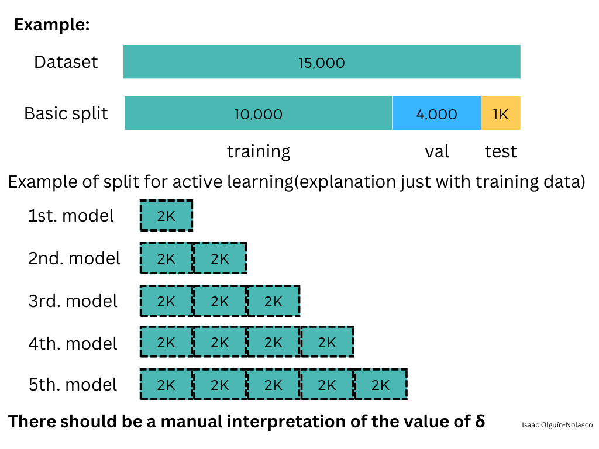

# AutomatedTraumaDetectionInGCT
Repository of the "Automated Trauma Detection in Genocide Court Transcripts" project.

As explained by Schirmer et al. in "Uncovering Trauma in Genocide Tribunals: An NLP Approach Using the Genocide Transcript Corpus", this project aims to use NLP techniques to uncover and analyze exposure to trauma to which witnesses in international criminal tribunals are subjected when recounting their experiences in court.

This repository contains the source code in its dev-version that has been developed as a collaboration between the TUM School of Computation, Information and Technology (CIT) and the TUM School of Governance at the Technical University of Munich (TUM) for the Interdisciplinary Project (IDP) required for the program of my master in Informatics (Computer Science).

The image below shows the pipeline followed by the project.

## Directory content

The whole structure of the project is as follows:
* **01_WebScraping_TribunalTranscriptCases.ipynb** Notebook that contains the implementation for scraping the trascripts from cases. It contains three big sections depending on the desired court. In addition to that, it is possible to retrieve only one transcript or multiple transcripts that may be given in an excel file. Files that are the input of the web-scraping processes may be located anywhere and user has to specified them, although it is suggested to locate them into the "input/" directory. Files that are result of these processes are stored into "output/clean_transcripts/[court]" where court can be "eccc", "ictr", or "icty". (This notebook covers the first three steps: "Input", "WebScraping", and "Format cleaning").
* **02_InfoExtractionFromJson.ipynb** Notebook that has the implementation for extracting the information of cases, their sentences and corresponding labels; and store them into an excel file that will be used for the classification process. (This notebook covers part of the fourth step "Segmentation and labeling").
* **03_BinaryClassification.ipynb** Notebook that executes the binary classification located in "src/binary_classification.py" (This notebook covers part of the fifth step "Classification").
* **04_Multiclass_Classification_Model.ipynb** Notebook that executes the multiclass classification (outdated version)
* **05_ActiveLearning.ipynb** Notebook that executes the active learning implementation located in "src/active_learning.py" (This notebook covers part of the fifth step "Classification").
* **06_AnalysisOfComparableModels.ipynb** Notebook that contains the implementation for extracting information from JSON statistic files and plot them in order to compare performances of the conducted experiments (This notebook covers part of the sixth step "Analysis of Comparable Models").
* **07_XAI_Shap.ipynb** Notebook that contains the implementation for using Shap in order to obtain information that allows us to make conclusions about the behaviour of the model as well as inferences of what it/they are learning and therefore, the reasons of their predictions. (This notebook covers part of the seventh step "Analysis of Comparable Models").
* **config.yml** File that contains all configurable parameters required by the implementation in order to be executed. User does not need to make any change in the current source implementation (unless that is desired) but changes depend on the only configuration of this file.
* **src/**
  - **active_learning.py**
  - **binary_classification.py**
  - **classification_model_utilities.py**
  - **cleaning_transcripts.py**
  - **general_utilities.py**
  - **multilabel_classification.py**
  - **utilities_project.py**
* **input/**
  - **json** Directory where the json file has to be located in order to get the information that will be used for the classification task.
  - **dataset** Directory where the dataset for the classification task has to be located. (Once the information is extracted from the JSON file, the process also stores the Dataset here under the name Dataset.xlsx)
* **logs/** Directory where log files are stored.
* **output/**
  - **clean_transcripts**
    - **eccc** Directory where pre-processed files, which belong to the ECCC court belong, are stored.
    - **ictr** Directory where pre-processed files, which belong to the ICTR court belong, are stored.
    - **icty** Directory where pre-processed files, which belong to the ICTY court belong, are stored.
  - **xai**
* **models/** Directory where models are stored.

## Pipeline steps' descriptions

### Input
User has the responsibility to choose those cases that are of their interest. It is required to store the following information into an excel file which has to be located in "/input/" for each court. Files must not have a header, but a list of documents that contain the next fields: "url", "court", "accused", "case", "date", and "witness". (These fields can be modified accordingly to the needs of the user. However, it has been stated as a template).

Depending on the court, the user has to copy and paste the link of the cases' documents in specific formats (i.e. user has to state properly the link to access specific resources on the website of the court).

| Court              | Required format     | Example |
| ---                   | :---:             | --- |
| [International criminal tribunal for the former Yugoslavia](https://www.icty.org/) | HTM(L) | https://www.icty.org/x/cases/stakic/trans/en/020524IT.htm |
| [Extraordinary Chamber in the Courts of Cambodia](https://www.eccc.gov.kh/) | PDF | http://www.eccc.gov.kh/sites/default/files/documents/courtdoc/%5Bdate-in-tz%5D/E1_67.1_TR001_20090824_Final_EN_Pub.pdf |
| [International Criminal Tribunal for Rwanda](https://ucr.irmct.org/) | DOC | https://ucr.irmct.org/LegalRef/CMSDocStore/Public/English/Transcript/NotIndexable/ICTR-98-44/TRS15978R0000616228.DOC |

### WebScraping
WebScraping is a way to extract information that has been published on the internet. Specific restrictions and permissions apply depending on the website where this data is obtained. In the case of the courts, ICTR does not specify any restriction and for the remaining two courts, WebScraping is allowed. 

This step considers the extraction of the files from the courts' webpages and their storage into txt files without any kind of additional cleaning or transformation.

Specific paths to files have to be changed in the Notebook "01_WebScraping_TribunalTranscriptCases.ipynb".

### Format cleaning
TXT files with the content of HTM(L), PDF, DOC(X) files are read and those specific data that is not of the project's interest is removed. e.g. HTM(L) files contain several tags that are removed by regular expressions. Other regular expressions also remove specific headers of the cases as well as page numbers. Lower-case is also applied in this step.

Most of the unnecesary information has been already identified and mechanisms for removing such instances has been implemented. However, depending on the cases, current mechanisms may be insufficient to new samples with different structures/labels/tags/etc. This will require manual intervention by the user or the implementation of new mechanisms into the cleaning source script.

### Segmentation and labeling
Clean TXT files are uploaded onto a platform that allows the segmentation of sentences and labeling them accordingly to pre-defined classes. As a result, it is possible to extract JSON files with all the information related to all the desired cases. Once the extraction (JSON document) is applied, data is obtained and exported into an Excel file with individual sentences and their corresponding labels. This will work as the dataset needed for the classification task.

### Classification
Binary classification is implemented and the implementation allows the configuration of hyperparameters as well as experiments with different models such as bert-base-uncased, legal-bert-base-uncased, hateBERT, ConfliBERT-scr-uncased, and others.
The list of configurable parameters is:
| Variable              | Default value     | Description |
| ---                   | :---:             | --- |
| **training_model**    |  |  |
| model_name            | bert-base-uncased | User has to introduced the name of the model that is specified by HuggingFace |
| epochs                | 3                 | Number of epochs for the training                                             |
| batch_size            | 32                | Batch size (usually it is specified as: 8, 16, or 32)                         |
| embedding_size        | 512               | Size of the embeddings (max in BERT is 512)                                   |
| return_attention_mask | True              | Possibility to enable/disable the return of the attention mask                |
| cross_validation      | False             | Activate/deactivate the cross-validation during training                      |
| save_model            | True              | Enable/disable the possibility for saving the model that is to be trained     |
| store_statistics      | True              | Enable/disable the possibility for storing the statistics of the model        |
| test_model            | True              | Enable/disable the possibility of testing the model once it has finished the train & eval phases |
| add_special_tokes     | True              | Enable/disable the possibility of adding tokens to embeddings                 |
| max_length            | 512               | Max length of embeddings                                                      |
| pad_to_max_length     | True              | Activate/desactivate the padding feature                                      |
| run_in_gpu            | True              | Activate the possibility of running the model using a GPU if available        |
| classification_task   | binary            | Token that specifies the classification to be run [binary|multi]. Currently only binary |
| learning_rate         | 1e-6              | Learning rate                                                                 |
| epsilon_optimizer     | 1e-8              | Epsilon for the optimizer                                                     |
| weight_decay          | 0                 | Weight decay specified for the optimizer                                      |
| size_dataset          | 0                 | "use all the dataset" if 0 otherwise "use the number specified here"          | 
| mode_select_elems_dataset | "random"      | If "size_dataset"!=0, then this var speficies the way to choose samples. Currently only random |
| **general_set_up**    |  |  |
| dataset_filename      | [filename].xlsx   | Specified the name of the file                                                |
| input_dir_name        | input             | Name of the input directory                                                   |
| output_dir_name       | output            | Name of the output directory                                                  |
| dataset_dir_name      | dataset           | Name of the directory where the dataset is located                            |
| logs_dir_name         | logs              | Name of the logs directory. Here logs are stored                              |
| models_dir_name       | models            | Name of the models directory. Here models are saved                           |
| plots_dir_name        | plots             | Name of the plots directory. Plots are stored here                            |
| **active_training**   | | |
| size_splits_dataset   | 8                 | Size for the chunks that will be applicable to Active Learning                |
| classification_task   | binary            | Type of classification that the user wants to apply the Active Learning impl. |
| **dataset**    |  |  |
| index_columns_dataset | 1                 |   |
| list_columns_names    | *spec. in desc*   | ["tribunal", "id_transcript", "case", "accused", "date", "text", "trauma", "role", "witnesses", "n_witnesses", "start", "id_annotation", "id_document"]| 
| col_of_interest_binary_classif        | trauma    | Name of the column from the dataset that contains the classes and labels of each sentence for binary classification |
| col_of_interest_multi_label_classif   | role      | Name of the column from the dataset that contains the classes and labels of each sentence for multiclass classification |
| col_of_reference_binary_classif       | text      | Name of the column that acts as a reference for the classification. i.e. contains the content of the sentence. This field is for binary class. |
| col_of_reference_multi_label_classif  | text      | Name of the column that acts as a reference for the classification. i.e. contains the content of the sentence. This field is for multi-class class. |
| **models**    |  |  |
| bert                  | *spec. in desc*   | ["bert-base-uncased", "nlpaueb/legal-bert-base-uncased"]                      |
| other                 | *spec. in desc*   | ["snowood1/ConfliBERT-scr-uncased", "GroNLP/hateBERT"]                        |

### Comparable models' analysis
Information from the statistics of each model is extracted and plot. This implementation aims to give the user the information/tools for analysis and making-decision.

### Explainability AI (XAI)
Implementation that allows to load the model and execute some of the features provided by Shap in order to analyse the information provided by the model and make inferences/deductions/conclusions about its learning, predictions, and results.

## Additionals

### Active Learning

## Citation

This job resulted in the [acceptance](https://icail2023.di.uminho.pt/) and publication of the paper "Uncovering Trauma in Genocide Tribunals: An NLP Approach Using the Genocide Transcript Corpus" conducted by Miriam Schirmer, Isaac Misael Olguín Nolasco, Edoardo Mosca, Shanshan Xu, and Jürgen Pfeffer, which was presented in the 19th International Conference on Artificial Intelligence and Law ([ICAIL 2023](https://icail2023.di.uminho.pt/)) in Braga, Portugal.